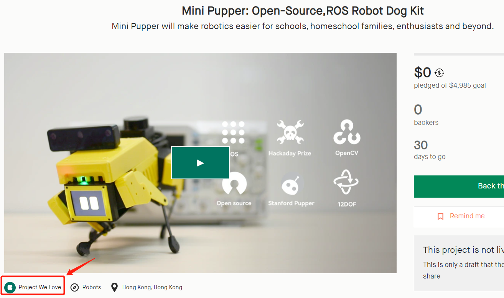
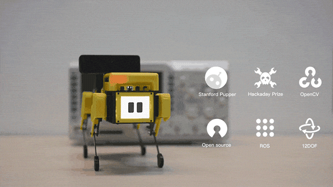
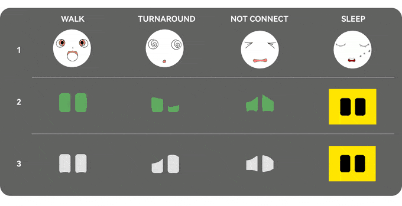
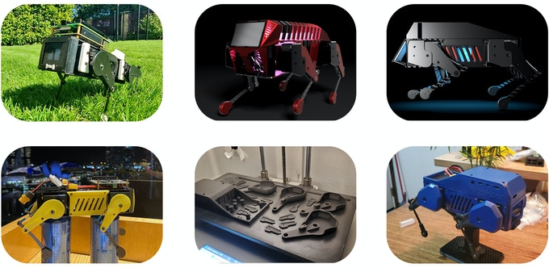
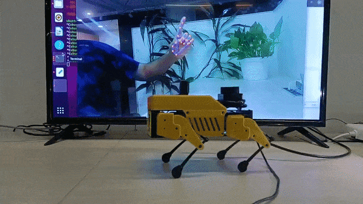
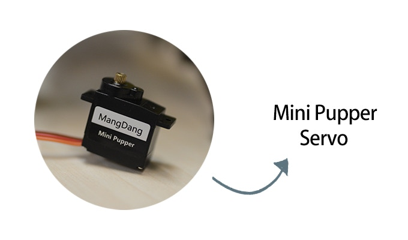

# Mini Pupper - Open-Source,ROS Robot Dog Kit
Mini Pupper already won the honor of ["Project We Love" from Kickstarter](https://www.kickstarter.com/projects/336477435/mini-pupper-open-sourceros-robot-dog-kit) before the campaign goes live at 9 AM(GMT-4) on 9/29, and was also endorsed by ROS.

YouTube Channel:
- https://www.youtube.com/channel/UCqHWYGXmnoO7VWHmENje3ug

## Mini Pupper Kickstarter Campaign

Mini Pupper has been launched on Stanford Pupper website, and will launch on Kickstarter very soon.
You can find our [Mini Pupper Prototype](https://youtu.be/rMgQ13uQCG0), on Dec, 2020, we used more than 8+ months to make Mini Pupper stable, there is NO risk to ship it to you.

You will receive not only the hardware kit, but also more high quality services. It will be very convenient and helpful to let you make your own robot dog.
- Mini Pupper Hardware kit.
- High quality global shipment service.
- Free software updates.
- Free course from global hackers.
- Global local support service, including but not limited North American, Japan, EU, UK, China.
- Join our community to discuss with other guys worldwide.

[Mini Pupper Kickstarter Campaign](https://www.kickstarter.com/projects/336477435/mini-pupper-open-sourceros-robot-dog-kit).

## Problem
There is no ROS, open-source robot dog platform to study at less than $1,000USD.
During the dog days of summer, you maybe see many demos from Boston Dynamics Spot Mini, many guys want to own their own robot dog to explore the functions, but the price is too high to accept, and it is not easy to explore the robot dog features.TurtleBot is very convenient for wheeled robot study, but not legged robots. 

## Solution and Product
Beginning last year, we shipped many Stanford Pupper units worldwide. After such global success with Pupper, we took to heart all the feedback from this endeavor. What do our customers want in our products? What kind of products do they like? After more than 11 months pursuing these requests, we would like to show you what we came up with. Mini Pupper!

Mini Pupper is the first ROS, open-source robot dog platform that supports ROS SLAM, Navigation, and AI features with Lidar, camera, and other sensors. It's really a Boston Dynamics Spot Robot Dog in the Palm and legged "TurtleBot"  for study at less than $500USD. 

Mini Pupper will make robotics easier for schools, homeschool families, enthusiasts, and beyond.

## What's Mini Pupper's value?
### Open source: DIY what your custom robot dog
In June 2021, MangDang released Mini Pupper on the [Stanford Pupper website](https://stanfordstudentrobotics.org/pupper) in collaboration with Nathan Kau, the original creator of Stanford Pupper, to bring to market a commercial and reasonably priced educational quadruped robot that anyone could engagingly use for fun robotics research and experiments.

#### Software custom 
##### Gait Performance
You can use Mini Pupper to explore many gait performances, such as Trot (diagonal pairs), Pace (lateral pairs), and the Bound (front and rear pairs).

##### Facial Animation
You can easily custom your own facial animation, mechanical shell, and your own algorithms, we will supply enough guide documents and videos to make it easy. Here are three preset animations, you can change and make your own set with just one click!

##### Hardware custom 
You can DIY and customize a UNIQUE MiniPupper in the world.  Check out those MiniPuppers created by our fans!

##### What’s More
Raspberry Pi: MiniPupper is super expandable. You can explore more with MiniPupper!

### ROS: A Dynamic System that You Can Keep Developing
Mini Pupper is a dog-shaped robot that is aimed at stimulating and empowering your creativity. That’s why we are not presenting it as a closed project that can’t evolve from here. On the contrary, Mini Pupper leverages Ubuntu and ROS to operate its FSN (Full Self-Navigation) System.

Mini Pupper supports not only Melodic but also Noetic. ROS2 is also in our pipeline.
#### SLAM
MiniPupper supports SLAM (Simultaneous Localization and Mapping), it can map its environment and learn in real-time from things around using Lidar or a camera sensor.

#### Navigation
With the map, MiniPupper can answer "where am I? Where am I going?" you can call it self-driving technology.

#### AI: OpenCV
Mini Pupper supports OpenCV's latest 3D camera module, named OAK-D LITE, it brings the superpowers of Spatial AI to the price-point necessary to unlock all sorts of applications. With the module, Mini Pupper can run face detect, recognition, object detect, recognition, etc.

With OAK-D-Lite vision, it's now your Border-Collie-level smart robotic dog. Border Collies are amazing because they can learn very specific hand signals (and they're neurotic about them). Now Mini Pupper can be just as amazing (and neurotic)!

## Why Mini Pupper Stands Out?
### Custom Servo
Our Mini Pupper servo is a custom servo to meet the requirements of our new Pupper! Compact, Durable, Unique. To run the Mini Pupper organically and smoothly, high torque & high-fidelity servos were required. We tested many servos on the market and have not found any 9g servo up to the task. After too many Q.C issues we finally gave up on off-the-shelf hobbyist servos, the last thing we want is for our intelligent customers to be let down by poor quality servos. So, we spent several months optimizing and configuring a servo that would work for our project, including tuning the servo parameters ourselves! It is now named Mini Pupper servo.

### 12 DOF (degree of freedom)

The Mini Pupper has 12 DOF (degree of freedom), unlike the 8 DOF available through similar projects. There was a lot of debate within our team about whether we should keep with norms and produce the same 8 DOF. After much debate, we concluded 8 DOF robots lack the ability to follow natural biological movements. The benefits of an 8 DOF quadruped only seemed to benefit the producer as the cost of the robot and parts required would be less. But we would have lost the original inspiration of the project… Which was to provide our customers with the highest quality best performing robot in this price range. All the servos are controlled one by one by a PCA9685. The gait performance is dependent on the 12 servos control loop time, requiring more effort to optimize 12 DOF vs 8DOF. There were doubts we could accomplish this with such a low price point. Although it was a challenge, after several months Mini Pupper is the first consumer 12 DOF quadruped robot in the world with a mass production intention.

## Education Courses
We are targeting Mini Pupper for education. Education courses are also coming. To make the study of Mini Pupper easy and convenient, the courses will be released step by step, including mechanical, hardware, ROS, SLAM, navigation, AI functions, and so on. If you’ve been searching for an open-sourced consumer-grade quadruped research robot, Mini Pupper is the best platform for you.
We are inviting 10 professional hackers worldwide to prepare the courses. It will be unlike anything that you've ever seen before. 

## How to use it? 
You can use the controller to enjoy and explore Mini Pupper's many features. Besides that, you can easily custom your own facial animation and algorithms by PC, we will supply enough guide documents and videos to make it easy.
[Youtube Channel](https://youtu.be/jP8PqqIQnSk)

## How to Build 
To get started, check out the pages linked below on part sourcing and assembly.  
- BOM list: https://drive.google.com/file/d/18phJat8GdK5Yq5p4K1ZmfY1-nMf1lQw4/view?usp=sharing
- Fusion 360 CAD model: https://a360.co/3fS15a1
- Assembly Instructions: https://drive.google.com/file/d/12Xbnqv3Rm7TEcjBZVSbVkBVNKNO3IOfm/view?usp=sharing

- Software Installation: https://github.com/mangdangroboticsclub/QuadrupedRobot/blob/MiniPupper/Doc/guide/software_installation.rst
- Calibration Instruction and video guide: 
   https://drive.google.com/file/d/1GKVg3EnKxrpOwSu_p4mhcSkNuLoSejXy/view?usp=sharing    
   https://youtu.be/oMQS_zwIw40
- Robot operation(same with pupper): https://pupper.readthedocs.io/en/latest/guide/operation.html

## Help
- Feel free to raise an issue (https://github.com/mangdangroboticsclub/QuadrupedRobot/issues) or send mail to fae@mangdang.net
- We also have a Google group set up here: https://groups.google.com/g/minipupper

## About Stanford Student Robotics
[Stanford Student Robotics](https://stanfordstudentrobotics.org/) is an entirely student-run group dedicated to building cool robots and learning new things. You can find many amazing projects on the website. Mini Pupper project is supported by [Nathan Kau](https://github.com/stanfordroboticsclub/StanfordQuadruped) from Stanford Student Robotics.

## About MangDang Technology Co., Limited
Founded in 2020, [MangDang Technology Co., Limited](https://www.mangdang.net/) (MangDang) specializes in the research, development, and production of robot products that make peoples lives better. Mangdang is headquartered in HongKong, with R&D offices in Beijing. We are a global team with members from many countries and regions such as the United States, Japan, Canada, Europe, China and so on.
- Mission: Using AI to make life better.
- Vision: Every home, every one can use our robot product to make life better.

We are all dreamers, we look forward to connecting talents worldwide and innovating together to perform splendid times! 
- For business, you can connect us by mail(sales@mangdang.net).
- Beijing Office address: Innostyle, Building 5, No.36 Haidian West Street, Haidian District, Beijing, China.
- Our online channel: [Youtube](https://www.youtube.com/channel/UCqHWYGXmnoO7VWHmENje3ug/featured), [Twitter](https://twitter.com/LeggedRobot), [FaceBook](https://www.facebook.com/afreez.gan/) 
